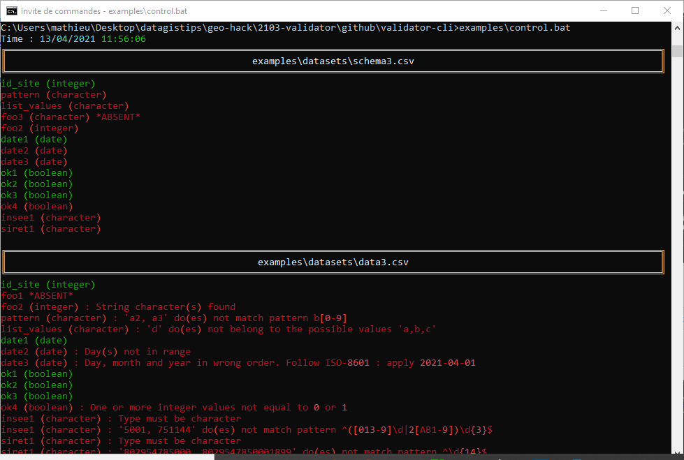
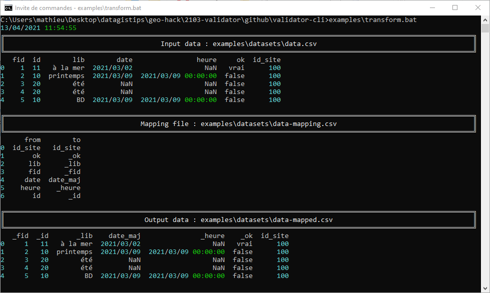

# validator-cli

`validator-cli` is a command line interface to [validator](https://github.com/datagistips/validator). It enables you to :

- **control** your data (against a data schema)
- **transform** it (against a mapping file)

>

	usage: validator-cli.py [-h] [-d] {control,transform} input schema
	
	positional arguments:
	  {control,transform}  'control' data against a data schema or 'transform' data thanks to a mapping file
	  input                input file or directory (depends if you specified -d or not)
	  schema               data schema file path (if 'control' mode) or mapping file (if 'transform' mode)
	
	optional arguments:
	  -h, --help           show this help message and exit
	  -d, --directory      process entire directory

## Create your data schema file

The data schema file used in validator is a simplified form of [frictionlessdata table schema](https://specs.frictionlessdata.io/table-schema/)

It must be a CSV file. You will find a CSV example file [here](examples/datasets/schema3.csv).

Here is an example of data schema file :

|name       |type     |pattern                    |enum           |
|-----------|---------|---------------------------|---------------|
|id_site    |integer  |                           |               |
|name       |character|                           |               |
|weight       |float  |                           |               |
|date      |date     |                           |               |
|ok        |boolean  |                           |               |
|values|character|                           |["a", "b", "c"]|
|city_code     |character|^([013-9]\d&#124;2[AB1-9])\d{3}$|               |
|siret     |character|^\d{14}$                   |               |

### `type`
Valid types are :

- `string` or `text` or `character`
- `date`
- `datetime`
- `duration`
- `boolean`
- `number`
- `integer`

### `pattern`
Use `pattern` if your values must match a regular expression.

### `enum`
Use `enum` if your values must belong to a list of values.

## Control your data with `control`

Control a single file against your data schema

	python validator-cli.py control data.csv schema.csv

Control an entire directory of files

	python validator-cli.py control -d my_dir schema.csv

See below to see the log output.

## Transform your data in :two: steps

### 1️⃣ Prepare your mapping file

For this, you can use the [validator GUI assistant](https://github.com/datagistips/validator)

The mapping file, named in the above animation `data-mapping.csv` specifies the source fields and the target fields for the renaming of the data. 

It has the following 2-column source-to-destination structure :

### :two: Transform your data with `transform`

### One file
This line will transform `data.csv` into `data-mapped.csv`, using source-target fields specifications contained in `mapping.csv`

	python validator-cli.py transform data.csv mapping.csv

### One directory
You can also transform files contained in a directory with `-d`

	python validator-cli.py transform -d my_dir mapping.csv

> Only data with the right structure will be transformed

## Log outputs

### `control` outputs
	python validator-cli.py control data3.csv schema3.csv

will output :

### `transform` outputs
	python validator-cli.py transform data.csv mapping.csv

will output :

### Logs
You can redirect print messages to a log file like this :

	python validator-cli.py control data.csv standard.csv > log.txt
